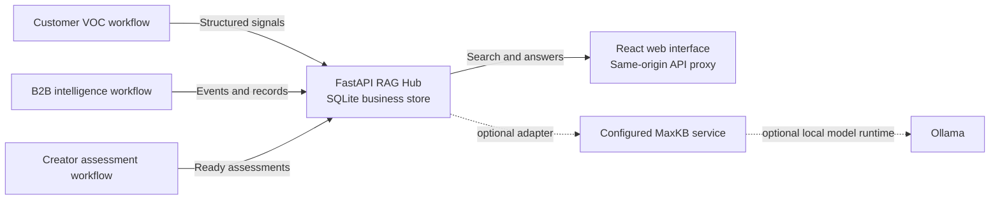

# Global Market Intelligence and Risk Analysis Platform

An AI-assisted decision-support prototype that connects customer voice (VOC), cross-border B2B market and compliance intelligence, and creator (KOL) signals through a shared, local retrieval-augmented generation (RAG) hub.

Its featured workflow starts from an active consumer risk, retrieves evidence from the configured VOC, B2B, and creator knowledge bases, and checks source records and versions before drafting a cited cross-domain investigation. The draft highlights domain gaps and proposes follow-up tasks for an operator to review. Approval creates coordination records; rejection creates none. This is a research prototype: outputs require human review, and the system does not validate market impact or legal compliance.

## What the platform includes

| Workflow | Purpose |
| --- | --- |
| Customer voice (VOC) | Analyze consumer feedback and prepare normalized sentiment signals for downstream use. |
| B2B market and compliance support | Organize market and regulatory intelligence, business opportunities, and partner-matching workflows. |
| Creator (KOL) assessment | Support creator profiles, commercial and risk assessment, comparisons, and collaboration workflows. |
| Shared RAG hub | Ingest structured records, provide search and question-answering APIs, and track record, risk, and synchronization status. |

## Architecture



MaxKB and Ollama are optional external services. The public repository contains the integration code, not a vendored copy of MaxKB.

## Repository layout

| Path | Role |
| --- | --- |
| [Customer VOC analysis](customer-voc/sentiment-analysis/voc-sentiment-analysis) | Customer review analysis and VOC event preparation. |
| [B2B compliance support](b2b-public-sector/week7/compliance-sales-support) | Compliance intelligence and opportunity support for public-sector and enterprise projects. |
| [Global creator assessment](creator-intelligence/global-creator-assessment-platform/app) | Creator assessment and collaboration platform. |
| `overseas_shared` | Shared data contracts and event types. |
| `rag/service` | FastAPI ingestion, query, record, and coordination APIs. |
| `rag/frontend-v2` | React and TypeScript RAG interface with a same-origin proxy. |
| `rag/launcher` | Windows and macOS scripts for the integrated local workflow. |

## Local setup

The integrated workflow expects Python 3.11 or later, Node.js with pnpm, and local configuration for the component services. MaxKB and Ollama are only needed when using those integrations. Each Python service has its own `requirements.txt`; the React interface uses pnpm. Install dependencies in the corresponding local virtual environments before launching the full workflow.

Build the RAG interface from the repository root:

```powershell
cd rag/frontend-v2
pnpm install --frozen-lockfile
pnpm run build
cd ../launcher
```

On Windows, start the integrated workflow with:

```powershell
powershell -ExecutionPolicy Bypass -File .\start-local-pipeline.ps1 -OpenBrowser
```

On macOS, from `rag/launcher`, make the launcher executable once and run it:

```bash
chmod +x start-local-pipeline.sh
./start-local-pipeline.sh --open-browser
```

To run only the RAG Hub, install its dependencies in `rag/service`, create a local `.env` from `.env.example`, set a private `RAG_HUB_API_KEY`, and start the service:

```bash
cd rag/service
python -m pip install -r requirements.txt
python -m uvicorn app.main:app --host 127.0.0.1 --port 8001
```

The integrated launcher uses these local endpoints by default:

| Service | Address |
| --- | --- |
| Customer VOC | `http://127.0.0.1:8765/` |
| B2B support | `http://127.0.0.1:8000/` |
| Creator platform | `http://127.0.0.1:8766/` |
| RAG Hub API | `http://127.0.0.1:8001/` |
| RAG web interface | `http://127.0.0.1:8010/` |
| Optional MaxKB service | `http://127.0.0.1:8080/` |

## Cross-domain risk investigation Agent MVP

The Alert page includes a manually started investigation for an active consumer risk. It searches the configured consumer, B2B, and KOL knowledge bases, checks returned documents against the current records and source versions, and saves a cited draft with proposed follow-up tasks. Operators can review and edit the task drafts before approval. Approval creates the coordination event, association candidate, case, and proposed tasks in one database transaction; rejection creates none of those records.

To use this MVP, configure `RAG_HUB_ADAPTER=maxkb`, the `MAXKB_KB_C_CURRENT`, `MAXKB_KB_C_HISTORY`, `MAXKB_KB_B_BUSINESS`, and `MAXKB_KB_KOL` knowledge-base IDs, and a reachable local Ollama model through `RAG_HUB_OLLAMA_BASE_URL` and `RAG_HUB_OLLAMA_TEXT_MODEL`. The default `fake` adapter intentionally disables investigation so it cannot present simulated retrieval as real evidence. The database migration runs with the service startup.

Open **Alert Coordination**, select an active risk, and choose **Investigate risk**. Review the evidence versions, domain gaps, limitations, and proposed tasks. Approve only when the sources are still current; a stale draft must be replaced by a new run. A process restart marks queued or running investigations as interrupted, so start a new run after the service returns.

This is a research prototype for decision support. Model-generated summaries and tasks can be incomplete or wrong. Human review is required, and the MVP does not validate market impact, legal compliance, or investment decisions.

## Data and security

The public snapshot excludes raw customer-review and creator spreadsheets, local databases, uploaded records, internal project documents, presentation screenshots, and the original Git history. The `.env.example` files are templates only. Keep API keys, service tokens, passwords, and real customer or creator records in local configuration and storage; do not commit them.

Use only data you are authorized to process. Review RAG outputs and source evidence before relying on them; generated answers may be incomplete or incorrect.

## Research scope

This repository documents a multi-workflow software design. It does not include a validated benchmark, causal analysis, or claims about model accuracy. Treat its outputs as decision support requiring human review.
